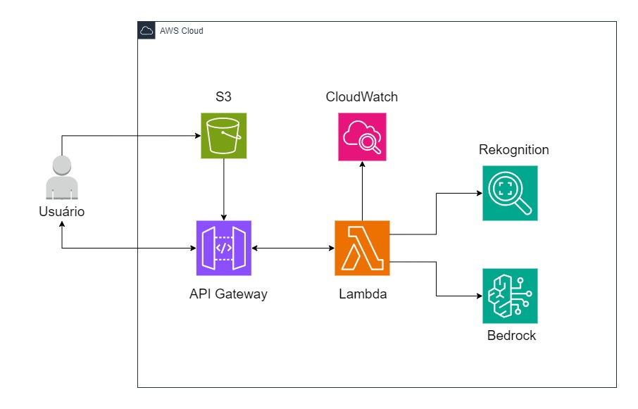

<h1 align="center">  😄 Emoções e Pets com Rekognition e Bedrock 🐾 </h1>

---

## 🌐 Sobre o Projeto

Este projeto consiste em uma aplicação serverless que analisa imagens armazenadas no Amazon S3 usando Amazon Rekognition e gera conteúdo com Amazon Bedrock.

A aplicação oferece duas rotas de análise:

- **Análise de Emoções:** Detecta emoções nas faces presentes na imagem.
- **Análise de Emoções e Animais de Estimação:** Além das emoções, identifica animais de estimação na imagem e gera um texto descritivo com dicas sobre os animais detectados, abordando comportamento, cuidados e saúde.
  Os resultados das análises são registrados no Amazon CloudWatch.

Os usuários interagem com a aplicação por meio de endpoints da API, podendo enviar imagens para análise e receber os resultados detalhados.

## 📂 Estrutura do Repositório

```bash
  📁 sprint-8-pb-aws-abril
  │
  ├── 📁 assets
  │       └── Arquitetura.jpg
  │
  ├── 📁 src
  │   │
  │   ├── 📁 routes
  │   │   │
  │   │   ├── 📁 v1
  │   │   │   ├── v1_description_route.py
  │   │   │   └── v1_vision_route.py
  │   │   │
  │   │   ├── 📁 v2
  │   │   │   ├── v2_description_route.py
  │   │   │   └── v2_vision_route.py
  │   │   │
  │   │   └── 📁 health
  │   │       └── health_route.py
  │   │
  │   ├── 📁 services
  │   │   ├── rekognition_service.py
  │   │   └── bedrock_service.py
  │   │
  │   ├── 📁 utils
  │   │   └── utils.py
  │   │
  │   ├── handler.py
  │   ├── requirements.txt
  │   └── serverless.yml
  │
  └── README.md
```

# 🚀 Como Usar

**1. Clone o repositório**

```bash
  git clone https://github.com/LuizFillipe1/analise-de-emocoes-e-pets.git
```

**2. Instale as dependências necessárias**

```bash
  npm install -g serverless
  pip install requirements.txt
```

**3. Configure suas credenciais AWS usando AWS CLI**

```bash
  aws configure
```

**4. Habilite o acesso ao modelo Amazon BedRock usado**

```bash
  Solicite o acesso ao modelo Amazon Titan Text G1 Premier no Amazon BedRock
```

**5. Execute o deploy da aplicação**

```bash
  serveless deploy
```

## 🔗 Acesso à API

- link v1: https://4p9adk0tb9.execute-api.us-east-1.amazonaws.com/v1/vision
- link v2: https://4p9adk0tb9.execute-api.us-east-1.amazonaws.com/v2/vision

## 📝 Exemplos de Requisições

- Rota v1/vision
  ```bash
  {
    "bucket": "imagens-sprint-8",
    "imageName": "medo.jpg"
  }
  ```
- Rota v2/vision
  ```bash
  {
    "bucket": "imagens-sprint-8",
    "imageName": "menina-e-labrador.jpg"
  }
  ```

## 📜 Exemplo de Respostas

- Rota v1/vision

```bash
{
   "url_to_image": "https://imagens-sprint-8.s3.amazonaws.com/medo.jpg",
   "created_image": "04-08-2024 22:51:12",
   "faces": [
       {
           "position": {
               "Height": 0.5144175887107849,
               "Left": 0.379184752702713,
               "Top": 0.19456768035888672,
               "Width": 0.22736132144927979
           },
           "classified_emotion": "FEAR",
           "classified_emotion_confidence": 99.94574737548828
       }
   ]
}
```

- Rota v2/vision

```bash
{
   "url_to_image": "https://imagens-sprint-8.s3.amazonaws.com/menina-e-labrador.jpg",
   "created_image": "04-08-2024 19:53:10",
   "faces": [
       {
           "position": {
               "Height": 0.411741703748703,
               "Left": 0.4257128834724426,
               "Top": 0.3372590243816376,
               "Width": 0.16853618621826172
           },
           "classified_emotion": "HAPPY",
           "classified_emotion_confidence": 99.67448425292969
       }
   ],
   "pets": [
       {
           "labels": [
               {
                   "Confidence": 97.98384857177734,
                   "Name": "Dog"
               },
               {
                   "Confidence": 97.98384857177734,
                   "Name": "Labrador Retriever"
               }
           ],
           "Dicas": [
               "Nível de Energia e Necessidades de Exercícios: O Labrador Retriever é um cão de tamanho médio-grande com níveis de energia muito elevados. Recomenda-se que eles realizem pelo menos 60 minutos de exercício diário para evitar excesso de peso e comportamento destrutivo. Considere atividades intensas, como corrida e busca, para mantê-los felizes e saudáveis.",
               "Temperamento e Comportamento: O Labrador Retriever é uma raça conhecida por seu temperamento amigável e afetuoso, tornando-o um excelente cão de família. Eles são inteligentes, fáceis de treinar e adoram brincar, o que os torna excelentes companheiros de atividades ao ar livre. No entanto, eles também são conhecidos por sua alegria de viver e necessidade de estar perto de seus donos, o que pode torná-los ansiosos quando deixados sozinhos por longos períodos. É importante fornecer a eles exercícios, estimulação mental e companhia para garantir que eles sejam felizes e saudáveis.",
               "Cuidados e Necessidades: Labradores Retrievers são cães ativos que necessitam de exercício diário, alimentação adequada e cuidados regulares com a higiene. Eles são conhecidos por sua inteligência e facilidade de treinamento, tornando-os uma ótima escolha para atividades como aprendizagem de truques, agilidade e busca e resgate. Devido ao seu pelo curto e denso, eles precisam de escovação regular para evitar caspa e pediculose.  Fonte: <https://www.petMD.com/dog/breeds/c_dg_labrador_retriever>",
               "Problemas de Saúde Comuns: Problemas de saúde comuns em Labrador Retrievers incluem displasia do quadril, cataratas, obesidade, displasia do coxo, distúrbios do trato digestivo e problemas cardíacos. É importante consultar regularmente um veterinário para acompanhar a saúde do animal e detectar quaisquer problemas precocemente."
           ]
       }
   ]
}
```

## 🖼️ Imagens para Teste

As seguintes imagens estão no Bucket "imagens-sprint-8"

#### imagens para a rota v1/vision

- feliz.jpg
- triste.jpg
- calmo.jpg
- raiva.jpg
- medo.jpg
- surpreso.jpg
- ronaldinho-e-zagallo.jpg
- chicobuarque.jpg

#### imagens para a rota v2/vision

- Labrador.jpg
- bordercollie.jpg
- siames.jpg
- peixepalhaco.jpg
- tucano.jpg
- snoopdogg-e-boxer.jpg
- menina-e-labrador.jpg

## 🏗️ Arquitetura do Projeto



## 👨‍💻 Autor

- [Luiz Fillipe Morais](https://github.com/LuizFillipe1)
